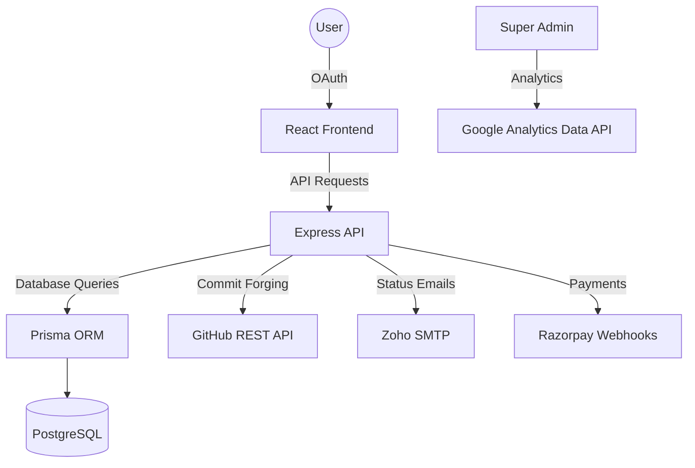

# GitCommitter 🚀

  
   
  

    <strong>Elevate Your GitHub Presence. Automate Your Contributions. Command Your Narrative.</strong>
  

  
  
  
  
  
  
   
   

---

## 🌟 Overview

**GitCommitter** is a premium, full-stack automation engine designed for the modern developer. It empowers you to maintain a consistent and impactful GitHub contribution graph without the manual overhead. Built with security and scalability at its core, GitCommitter forges authentic activity directly via the GitHub REST API, ensuring your profile stays active even when you're away.

> [!IMPORTANT]
> GitCommitter operates entirely through API-driven tree/blob manipulation. No local cloning, no footprint, just pure automated productivity.

---

## 🔥 Key Features

<table width="100%">
  <tr>
    <td width="50%" valign="top">
      <h3>🤖 Seamless Automation</h3>
      
Configure intelligent crons that simulate organic repository activity. Tailor your commit frequency to match your natural workflow.

    </td>
    <td width="50%" valign="top">
      <h3>🔐 OAuth Security</h3>
      
Secure, enterprise-grade authentication via GitHub OAuth. Your credentials never touch our database; only necessary scopes are requested.

    </td>
  </tr>
  <tr>
    <td width="50%" valign="top">
      <h3>📊 Advanced Analytics</h3>
      
A comprehensive superadmin dashboard powered by Google Analytics Data API. Visualize your impact with high-fidelity metric tracking.

    </td>
    <td width="50%" valign="top">
      <h3>💳 Pro Subscription</h3>
      
Unlock premium features including targeted contributions and priority scheduling, integrated flawlessly with Razorpay.

    </td>
  </tr>
</table>

---

## 🛠️ Tech Stack

GitCommitter is forged with the finest tools in the software industry:

-   **Frontend**: `React 19` + `Vite` for a blazingly fast, interactive UI.
-   **Styling**: `Tailwind CSS 4` for a sleek, Amoled-gold aesthetic.
-   **Backend**: `Node.js` + `Express` automation engine.
-   **Database**: `PostgreSQL` managed via `Prisma ORM`.
-   **Infrastructure**: `Docker` + `Vercel` for high-availability deployment.
-   **Messaging**: `Zoho SMTP` for reliable transactional communications.

---

## 🗺️ System Architecture

---

## 🌎 Live Experience

GitCommitter is designed for high-impact developers who value their time and their professional presence.

-   **Explore the Dashboard**: [wiroxa.com/gitcommitter](https://wiroxa.com/gitcommitter)
-   **Join the Pro Network**: Unlock dual-push synchronization and targeted repository strategy.

---

## 🤝 Community & Support

-   **Documentation**: Focused on architecture and automation standards.
-   **Feedback**: We value community input! Open an issue for feature requests.
-   **Security**: Please report vulnerabilities via our [SECURITY.md](./PublicGIT/SECURITY.md).

---

  
Forged with Precision by the Wiroxa Team

  

