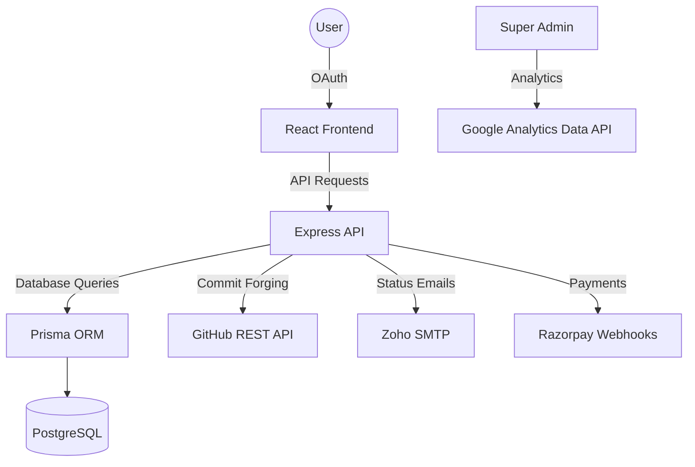

# GitCommitter 🚀

  
   
  

    <strong>Elevate Your GitHub Presence. Automate Your Contributions. Command Your Narrative.</strong>
  

  
  
  
  
  
   
   

---

## 🌟 Overview

**GitCommitter** is a premium, full-stack automation engine designed for the modern developer. It empowers you to maintain a consistent and impactful GitHub contribution graph without the manual overhead. Built with security and scalability at its core, GitCommitter forges authentic activity directly via the GitHub REST API, ensuring your profile stays active even when you're away.

---

## 💎 Advanced Features

### 🤖 Intelligent Contribution Forging
Our core engine simulates authentic developer activity by manipulating the Git tree/blob structure. It respects GitHub's API limits and pattern detection, creating a natural and consistent contribution history.

### 🔗 Dual-Push Synchronization (Exclusive)
Maintain two separate repositories in perfect sync. This feature is ideal for developers who want to bridge private enterprise work with a public-facing contribution portfolio without exposing internal codebases.

### 🔐 Enterprise-Grade Security
Your data is protected with AES-256 encryption at rest. We leverage GitHub OAuth for secure access, requesting only the specific scopes required to maintain your repositories.

### 📊 Real-Time Observability
A high-fidelity administrative dashboard providing deep insights into your automation pipelines. Monitor commit velocity, success rates, and repository status in real-time.

### 💳 Seamless Pro Integration
Integrated with Razorpay for automated subscription management. Unlock advanced scheduling, priority queues, and multiple repository support with a single click.

---

## 🗺️ System Architecture

---

## 🌎 Live Experience

GitCommitter is part of the Wiroxa ecosystem, designed for high-impact developers.

-   **Explore the Dashboard**: [gitcommitter.wiroxa.dev](https://gitcommitter.wiroxa.dev)
-   **Main Platform**: [wiroxa.dev](https://wiroxa.dev)
-   **Join the Pro Network**: Unlock dual-push synchronization and targeted repository strategy.

---

## 🤝 Community & Support

-   **Documentation**: Focused on architecture and automation standards.
-   **Feedback**: We value community input! Open an issue for feature requests.
-   **Security**: Please report vulnerabilities via our [SECURITY.md](./PublicGIT/SECURITY.md).

---

  
Forged with Precision by the Wiroxa Team

  

